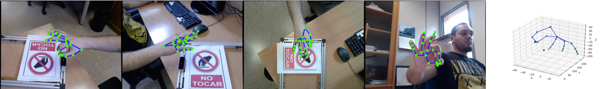

# Parsing the data in "Large-scale Multiview 3D Hand Pose Dataset"

**Code Author: Shih-Yao (Mike) Lin**

## Platform
+ Ubuntu/MacOS

## Dependencies
+ python3
+ opencv-python

## An example of the parsing results 


## hand keypoint labels in the dataset


## Installation
* Clone this repo
```bash
git clone https://github.com/mikeshihyaolin/dataset_parsing.git
```
## Dataset
http://www.rovit.ua.es/dataset/mhpdataset/

## Quick Start
+ write 2D hand images
```
python save_hand_pose.py -i [input_file_path] -v [camera_veiw] -o [output_img_path]
```

+ write 3D hand images
```
python save_hand_pose.py -i [input_file_path] -o [output_img_path]
```


