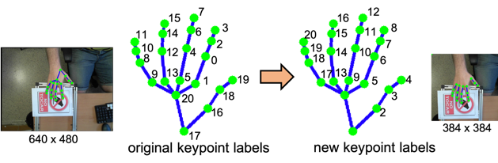

# Parsing the data in "Large-scale Multiview 3D Hand Pose Dataset"

**Code Author: Shih-Yao (Mike) Lin**

## Platform
+ Ubuntu/MacOS

## Dependencies
+ python3
+ opencv-python

## Dataset
http://www.rovit.ua.es/dataset/mhpdataset/

## Visulazie the parsing results 
[](https://youtu.be/YEqsGvIn1tE)
+ Some video results
[[video 1](https://youtu.be/dgS_X_bqhpM)] [[video 2](https://youtu.be/2Mk39D_Zyuw)] [[video 3](https://youtu.be/QRbjeIfjeyc)]  [[video 4](https://youtu.be/YEqsGvIn1tE)]

## hand keypoint labels 
<br/>
keypoint 0 and 1 are ignored in my new labels

## Processed data
If you do not want to download the original dataset and run any of my scripts, just download the results I have processed. 
[cropped hand images (3.5 GB)](https://drive.google.com/file/d/1-KaZ4mTBnpPFf-Dhg9UMcLSSbefAy9pw/view?usp=sharing)<br/>
[modified keypoint labels (9.6 MB)](https://drive.google.com/file/d/1CIJqPaYPn-MZ4PSLxHBM5kOkVNkM2JBQ/view?usp=sharing)<br/>
[cropped hand images with keypoints (3.9 GB)](https://drive.google.com/file/d/1zx6DWhtnwxRV8A_EoNUtsHDCXzOlB8Lx/view?usp=sharing)<br/>

## Quick start
+ Data Pre-processing
```
python script_pre-processing.py -i [dataset_path] -o [output_path] 
```
```
sh _bash4preprocessing.sh
```


## Usages of other scripts
+ write 2D hand images
```
python save_hand_pose.py -i [input_file_path] -v [camera_veiw] -o [output_img_path]
```

+ write 3D hand images
```
python save_hand_pose.py -i [input_file_path] -o [output_img_path]
```

+ crop hand 
```
python crop_hand.py -i [input_file_path] -v [camera_veiw] -o [output_img_path]
```

+ data pre-processing
```
python pre-processing_.py -i [input_file_path] -o [output_file_path] -d [data_number] -v [camera_veiw] 
```

+ load keypoints from the processed data
```
python load_keypoint_sample.py -i [input_hand_keypoint_pickle_file] 
``` 
```
...
frame 702
x: [0, 0, 231, 193, 169, 208, 162, 134, 122, 205, 151, 150, 166, 207, 157, 124, 102, 209, 183, 165, 149]
y: [0, 0, 252, 258, 252, 221, 218, 229, 241, 199, 217, 240, 247, 181, 174, 173, 174, 169, 146, 135, 127]
-------
frame 703
x: [0, 0, 225, 187, 172, 208, 164, 135, 121, 207, 158, 123, 107, 210, 160, 128, 106, 212, 187, 170, 152]
y: [0, 0, 256, 256, 241, 227, 222, 230, 239, 204, 189, 197, 209, 185, 175, 173, 174, 172, 148, 137, 129]
-------
frame 704
x: [0, 0, 222, 184, 166, 209, 167, 136, 121, 208, 162, 126, 108, 211, 163, 131, 108, 213, 185, 167, 149]
y: [0, 0, 255, 256, 242, 224, 215, 221, 231, 201, 183, 188, 200, 183, 169, 167, 168, 172, 148, 137, 129]
-------
frame 705
x: [0, 0, 224, 186, 177, 208, 163, 133, 119, 206, 165, 131, 106, 210, 158, 126, 105, 212, 185, 168, 151]
y: [0, 0, 255, 253, 235, 228, 223, 230, 240, 204, 184, 179, 181, 184, 182, 186, 192, 171, 149, 138, 129]
-------
frame 706
x: [0, 0, 221, 183, 174, 213, 174, 143, 124, 212, 169, 132, 111, 214, 166, 152, 151, 215, 187, 167, 148]
y: [0, 0, 251, 245, 226, 220, 211, 215, 223, 196, 175, 176, 185, 177, 194, 216, 230, 164, 143, 136, 134]
-------
frame 707
x: [0, 0, 255, 227, 210, 201, 154, 126, 107, 199, 149, 116, 95, 204, 160, 130, 110, 210, 178, 159, 141]
y: [0, 0, 226, 241, 253, 196, 193, 198, 205, 178, 163, 162, 166, 164, 144, 140, 142, 155, 137, 132, 133]
-------
number of frames: 708

```
<!-- 
 -->
